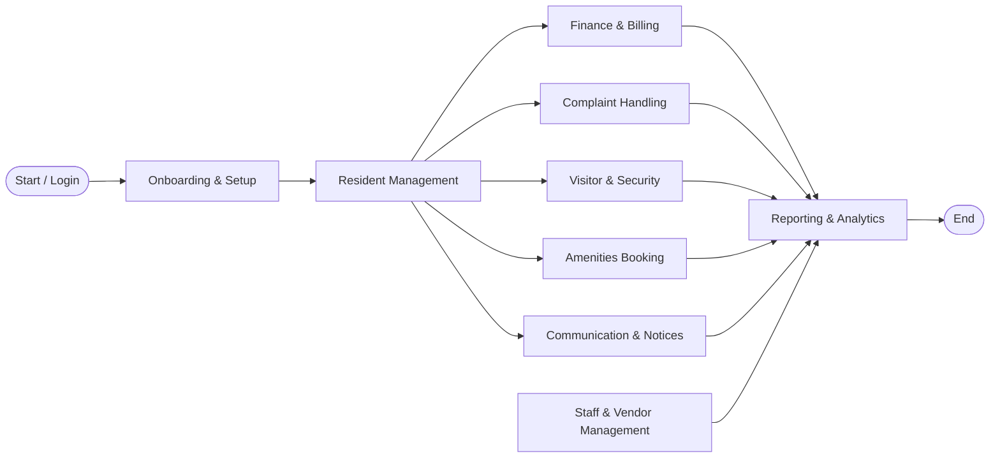
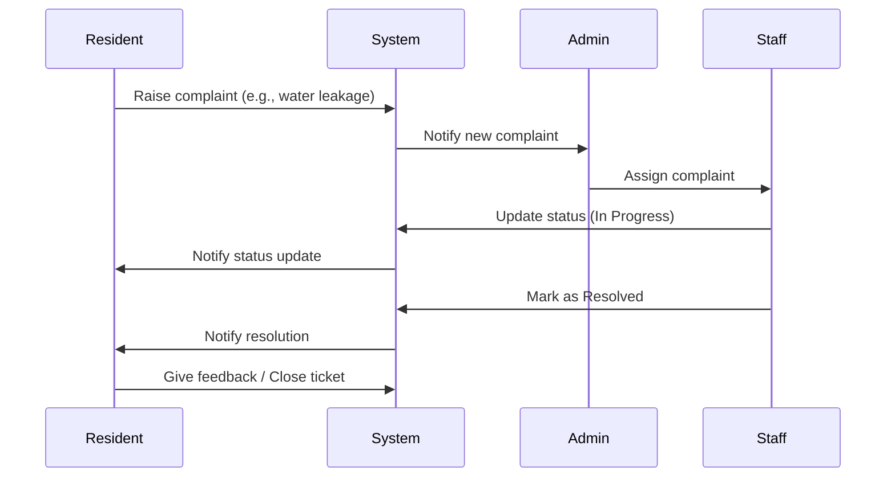
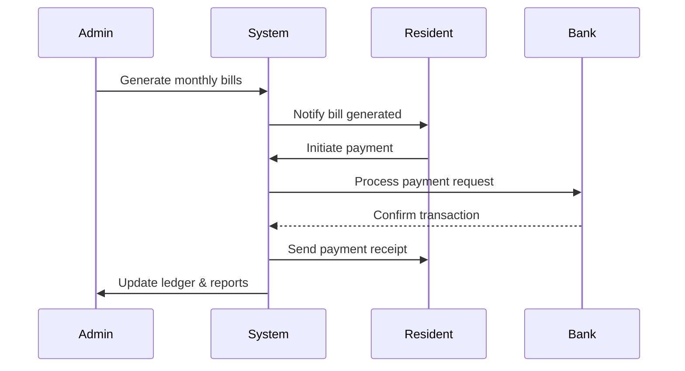
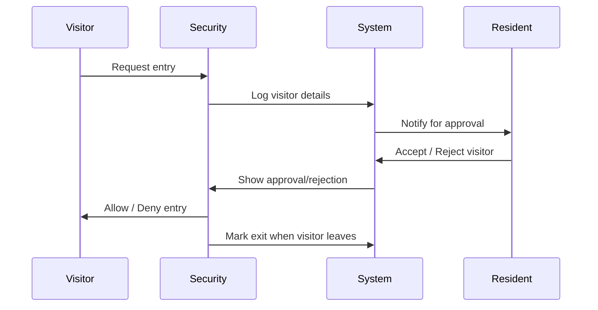

# 🏢 Society Management System — Mermaid Diagrams

Is document me Society Management System ke different diagrams Mermaid.js ke through represent kiye gaye hai.  
Aap isse directly GitHub par preview kar sakte ho ya [Mermaid Live Editor](https://mermaid.live/) me paste karke visualize kar sakte ho.  

---

## 🔹 Flowchart


---

## 🔹 Class Diagram
```mermaid
classDiagram
    class "Admin / Committee"
    class "Resident"
    class "Security / Gatekeeper"
    class "Staff / Vendors"

    class "Society Management System" {
        +Finance & Billing
        +Complaint & Service
        +Visitor Management
        +Amenities Booking
        +Communication & Notices
        +Reports & Analytics
    }

    "Admin / Committee" --> "Society Management System"
    "Resident" --> "Society Management System"
    "Security / Gatekeeper" --> "Society Management System"
    "Staff / Vendors" --> "Society Management System"
```

---

## 🔹 Sequence Diagrams  

### 🛠 1. Complaint Handling Workflow


---

### 💰 2. Finance & Billing Workflow


---

### 🛡 3. Visitor Management Workflow


---

### 🎟 4. Amenities Booking Workflow
```mermaid
sequenceDiagram
    participant Resident
    participant System
    participant Admin
    participant Bank

    Resident->>System: Request amenity booking
    System->>System: Check availability
    alt Available
        System->>Resident: Show confirmation & fee
        Resident->>System: Confirm & Pay
        System->>Bank: Process payment
        Bank-->>System: Payment successful
        System->>Resident: Confirm booking
        System->>Admin: Notify booking details
    else Not Available
        System->>Resident: Show unavailability
```
